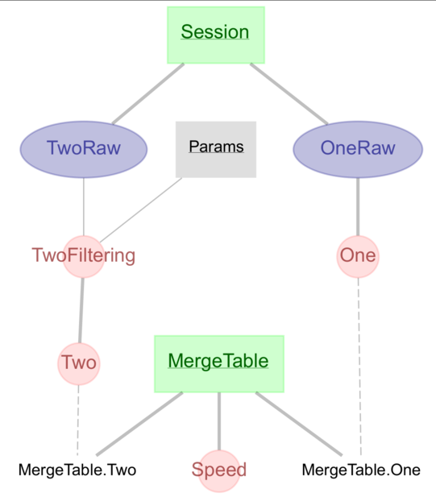

# Merge Tables

## Why

A pipeline may diverge when we want to process the same data in different ways.
Merge Tables allow us to join divergent pipelines together, and unify
downstream processing steps. For a more in depth discussion, please refer to
[this notebook](https://github.com/ttngu207/db-programming-with-datajoint/blob/master/notebooks/pipelines_merging_design_master_part.ipynb)
and related discussions [here](https://github.com/datajoint/datajoint-python/issues/151)
and [here](https://github.com/LorenFrankLab/spyglass/issues/469).

**Note:** Deleting entries upstream of Merge Tables will throw errors related to
deleting a part entry before the master. To circumvent this, you can add
`force_parts=True` to the
[`delete` function](https://datajoint.com/docs/core/datajoint-python/0.14/api/datajoint/__init__/#datajoint.table.Table.delete)
call, but this will leave and orphaned primary key in the master. Instead, use
`spyglass.utils.dj_merge_tables.delete_downstream_merge` to delete master/part pairs.

## What

A Merge Table is fundamentally a master table with one part for each divergent
pipeline. By convention...

1. The master table has one primary key, `merge_id`, a
   [UUID](https://en.wikipedia.org/wiki/Universally_unique_identifier), and one
   secondary attribute, `source`, which gives the part table name. Both are
   managed with the custom `insert` function of this class.

2. Each part table has inherits the final table in its respective pipeline, and
   shares the same name as this table.

```python
from spyglass.utils.dj_merge_tables import _Merge

@schema
class MergeTable(_Merge):
    definition = """
    merge_id: uuid
    ---
    source: varchar(32)
    """

    class One(dj.Part):
        definition = """
        -> master
        ---
        -> One
        """

    class Two(dj.Part):
        definition = """
        -> master
        ---
        -> Two
        """
```



## How

### Merging

The Merge class in Spyglass's utils is a subclass of DataJoint's [Manual
Table](https://datajoint.com/docs/core/design/tables/tiers/#data-entry-lookup-and-manual)
and adds functions to make the awkwardness of part tables more manageable.
These functions are described in the
[API section](../../api/src/spyglass/utils/dj_merge_tables/), under
`utils.dj_merge_tables`.

### Restricting

One quirk of these utilities is that they take restrictions as arguments,
rather than with operators. So `Table & "field='value'"` becomes
`MergeTable.merge_view(restriction={'field':'value}`). This is because
`merge_view` is a `Union` rather than a true Table. While `merge_view` can
accept all valid restrictions, `merge_get_part` and `merge_get_parent` have
additional restriction logic when supplied with `dicts`.

### Building Downstream

A downstream analysis will ideally be able to use all diverget piplelines
interchangeably. If there are parameters that may be required for downstream
processing, they should be included in the final table of the pipeline. In the
example above, both `One` and `Two` might have a secondary key `params`. A
downstream Computed table could do the following:

```python
def make(self, key):
    try:
        params = MergeTable.merge_get_parent(restriction=key).fetch('params')
    except DataJointError:
        params = default_params
    processed_data = self.processing_func(key, params)
```

Note that the `try/except` above catches a possible error in the event `params`
is not present in the parent.

## Example

First, we'll import various items related to the LFP Merge Table...

```python
from spyglass.utils.dj_merge_tables import delete_downstream_merge, Merge
from spyglass.common.common_ephys import LFP as CommonLFP  # Upstream 1
from spyglass.lfp.lfp_merge import LFPOutput  # Merge Table
from spyglass.lfp.v1.lfp import LFPV1  # Upstream 2
```

Merge Tables have multiple custom methods that begin with `merge`. `help` can
show us the docstring of each

```python
merge_methods=[d for d in dir(Merge) if d.startswith('merge')]
help(getattr(Merge,merge_methods[-1]))
```

We'll use this example to explore populating both `LFPV1` and the `LFPOutput`
Merge Table.

```python
nwb_file_dict = { # We'll use this later when fetching from the Merge Table
    "nwb_file_name": "tonks20211103_.nwb",
}
lfpv1_key = {
    **nwb_file_dict,
    "lfp_electrode_group_name": "CA1_test",
    "target_interval_list_name": "test interval2",
    "filter_name": "LFP 0-400 Hz",
    "filter_sampling_rate": 30000,
}
LFPV1.populate(lfpv1_key)  # Also populates LFPOutput
```

The Merge Table can also be populated with keys from `common_ephys.LFP`.

```python
common_keys_CH = CommonLFP.fetch(limit=3, as_dict=True) # CH61
LFPOutput.insert1(common_keys_CH[0], skip_duplicates=True)
LFPOutput.insert(common_keys_CH[1:], skip_duplicates=True)
common_keys_J1 = CommonLFP.fetch(limit=3, offset=80, as_dict=True) # J16
LFPOutput.insert(common_keys_J1, skip_duplicates=True)
```

`merge_view` shows a union of the master and all part tables.

```python
LFPOutput.merge_view()
LFPOutput.merge_view(restriction=lfpv1_key)
```

UUIDs help retain unique entries across all part tables. We can fetch NWB file
by referencing this or other features.

```python
uuid_key = LFPOutput.fetch(limit=1, as_dict=True)[-1]
restrict = LFPOutput & uuid_key
result1 = restrict.fetch_nwb()

nwb_key = LFPOutput.merge_restrict(nwb_file_dict).fetch(as_dict=True)[0]
result2 = (LFPOutput & nwb_key).fetch_nwb()
```

There are also functions for retrieving part/parent table(s) and fetching data.

1. These `get` functions will either return the part table of the Merge table or
   the parent table with the source information for that part.

2. This `fetch` will collect all relevant entries and return them as a list in
   the format specified by keyword arguments and one's DataJoint config.

```python
result3 = (LFPOutput & common_keys_CH[0]).merge_get_part(join_master=True)
result4 = LFPOutput().merge_get_part(restriction=common_keys_CH[0])
result5 = LFPOutput.merge_get_parent(restriction='nwb_file_name LIKE "CH%"')
result6 = result5.fetch('lfp_sampling_rate') # Sample rate for all CH* files
result7 = LFPOutput.merge_fetch("filter_name", "nwb_file_name")
result8 = LFPOutput.merge_fetch(as_dict=True)
```

When deleting from Merge Tables, we can either...

1. delete from the Merge Table itself with `merge_delete_part`, deleting both
   the master and part.

2. use `merge_delete_parent` to delete from the parent sources, getting rid of
   the entries in the source table they came from.

3. use `delete_downstream_merge` to find Merge Tables downstream and get rid
   full entries, avoiding orphaned master table entries.

The two latter cases can be destructive, so we include an extra layer of
protection with `dry_run`. When true (by default), these functions return
a list of tables with the entries that would otherwise be deleted.

```python
LFPOutput.merge_delete(common_keys_CH[0])  # Delete from merge table
LFPOutput.merge_delete_parent(restriction=nwb_file_dict, dry_run=True)
delete_downstream_merge(
    table=CommonLFP, restriction=common_keys_CH[0], dry_run=True
)
```
